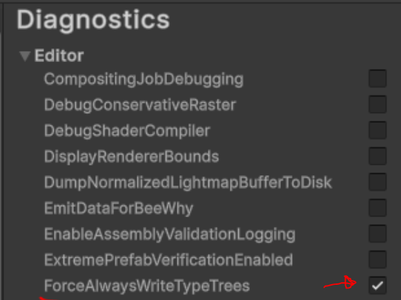

# Overview of Unity Content 

This section gives an overview of the core Unity file types and how they are used in different types of builds. It also covers the important concept of "TypeTrees".  This gives context for understanding what UnityDataTools can and cannot do.

## File Formats

### SerializedFile

A SerializedFile the name used for Unity's binary file format for serializing objects.  It is made up of a file header, 
then each Object, serialized one after another.  This binary format is also available in the Editor, but typically Editor content uses the Unity YAML format instead.

The SerializedFiles in build output represent the project content, but optimized for the target platform.  Unity will combine objects from multiple source assets together into files, exclude certain objects (for example editor-only objects), and potentially split or duplicate objects across multiple output files.  This arrangement of objects is called the `build layout`.  Because of all this transformation, there is not a one-to-one mapping between the source assets and the SerializedFiles in the build output.

### Unity Archive

An Unity Archive is a container file (similar to a zip file).  Unity can `mount` this file, which makes the files inside it visible to Unity's loading system, via the Unity "Virtual File System" (VFS).  Unity Archives often apply compression to the content, but it is also possible to create an uncompressed Archive.

## AssetBundles

[AssetBundles](https://docs.unity3d.com/Manual/AssetBundlesIntro.html) use the Unity Archive file format, with conventions for what to expect inside the archive.  The [Addressables](https://docs.unity3d.com/Manual/com.unity.addressables.html) package uses AssetBundles, so its build output is also made up of Unity Archive files.

AssetBundles always contain at least one SerializedFile.  In the case of an AssetBundle containing Scenes there will be multiple Serialized Files.  AssetBundles can also contain auxiliary files, such as .resS files containing Textures and Meshes, and .resource files containing audio or video.

UnityDataTools supports opening Archive files, so it is able to analyze AssetBundles.

## Player Builds

A player build produces content as well as compiled code (assemblies, executables) and various configuration files.  UnityDataTool only concerns itself with the content portion of that output.

The content compromises of the scenes in the Scene List, the contents of Resources folders, content from the Project Preferences (the "GlobalGameManagers") and also all Assets referenced from those root inputs.  This translates into SerializedFiles in the build output.

The SerializedFiles are named in a predictable way.  This is a very quick summary: 

* Each scene in the SceneList becomes a "level" file, e.g. "level0", "level1".
* Referenced Assets shared between the Scenes becomes "sharedAssets" files, e.g. "sharedAssets0.assets", "sharedAssets1.assets".
* The contents of the Resources folder becomes "resources.assets".
* The Preferences become "globalgamemanager", "globalgamemanager.assets".

If [compression](https://docs.unity3d.com/6000.2/Documentation/ScriptReference/BuildOptions.CompressWithLz4HC.html) is enabled, the Player build will compress all the serialized files into a single Unity Archive file, called `data.unity3d`.

### Enabling TypeTrees in the Player

UnityDataTools supports Player build output, because that uses the same SerializedFiles and Archives that AssetBundles use.  But often its output is not very useful. That is because, by default, Player builds do not include TypeTrees.

>[!IMPORTANT]
>It is possible to generate TypeTrees for the Player data, starting in Unity 2021.2.
>This makes that output compatible with UnityDataTool, but it is not a recommended flag to enable for your production builds.

To do so, the **ForceAlwaysWriteTypeTrees** Diagnostic Switch must be enabled in the Editor Preferences (Diagnostics->Editor section).

For more information about TypeTrees see the following section.

## TypeTrees

The TypeTree is a data structure exposing how objects have been serialized, i.e. the name, type and
size of their properties. It is used by Unity when loading an SerializedFile that was built by a
previous Unity version.  When Unity is deserializing an object it needs to check if the current Type 
definition exactly matches the Type definition used when the object was serialized.  If they do not match
Unity will attempt to match up the properties as best as it can, based on the property names and structure
of the data.  This process is called a "Safe Binary Read" and is somewhat slower than the regular fast binary read path.

TypeTrees are important in the case of AssetBundles, to avoid rebuilding and redistributing all AssetBundles after each minor upgrade of Unity or after doing minor changes to your MonoBehaviour and ScriptableObject serialization.  However there can be a noticable overhead to storing the TypeTrees in each AssetBundle, e.g. the header size of each SerializedFile is bigger.

TypeTrees also make it possible to load an AssetBundle in the Editor, when testing game play.

>[!NOTE]
>There is a flag available when building AssetBundles that will exclude TypeTrees, see [BuildAssetBundleOptions.DisableWriteTypeTree](https://docs.unity3d.com/6000.2/Documentation/ScriptReference/BuildAssetBundleOptions.DisableWriteTypeTree.html).  This has implications for future redistribution of your content, so use this flag with caution.

For Player Data the expectation is that you always rebuild all content together with each new build of the player. 
So the Assemblies and serialized objects will all have matching types definitions.  That is why, by default, the types are not included.

UnityDataTools relies on TypeTrees in order to understand the content of serialized objects.  Using this approach it does
not need to hard code any knowledge about what exact types and properties to expect inside each built-in Unity type
(for example Materials and Transforms).  And it can interpret serialized C# classes (e.g. MonoBehaviours, ScriptableObjects
and objects serialized through the SerializeReference attribute).  That also means that UnityDataTools cannot understand
Player built content, unless the Player was built with TypeTrees enabled.

>[!TIP]
>The `binary2text` tool supports an optional argument `-typeinfo` to enable dumping out the TypeTrees in a SerializedFile header.  That is a useful way to learn more about TypeTrees and to see exactly how Unity data is represented in the binary format.

### Platform details for using UnityDataTool with Player Data

The output structure and file formats for a Unity Player build are quite platform specific.

On some platforms the content is packaged into platform-specific container files, for example Android builds use .apk and .obb files.  So accessing the actual SerializedFiles may involve mounting or extracting the content of those files, and possibly also opening a data.unity3d file inside them.

UnityDataTools directly supports opening the .data container file format used in Player builds that target Web platforms (e.g. WebGL).  Specifically the "archive list" and "archive extract" command line option works with that format.  Once extracted you can run other UnityDataTool commands on the output.

Android APK files are not difficult to open and expand using freely available utilities.  For example on Windows they can be opened using 7-zip. Once the content is extracted you can run UnityDataTool commands on the output.

## Mapping back to Source Assets

Because Unity rearranges objects in the build into a build layout there is no 1-1 mapping between the output files and the original source assets.  Only Scene files have a pretty direct mapping into the build output.

The UnityDataTool only looks at the output of the build, and has no information available about the source paths. This is expected, because the built output is optimized for speed and size, and there is no need to "leak" a lot of details about the source project in the data that gets shipped with the Player.

However in cases where you want to understand what contributes to the size your build, or to confirm whether certain content is actually included, then you may want to correlate the output back to the source assets in your project.

Often the source of content can be easily inferred, based on your own knowledge of your project, and the names of objects.  For example the name of a Shader should be unique, and typically has a filename that closely matches the Shader name.

You can also use the [BuildReport](https://docs.unity3d.com/Documentation/ScriptReference/Build.Reporting.BuildReport.html) for Player and AssetBundle builds (excluding Addressables).  The [Build Report Inspector](https://github.com/Unity-Technologies/BuildReportInspector) is a tool to aid in analyzing that data.  

For AssetBundles built by [BuildPipeline.BuildAssetBundles()](https://docs.unity3d.com/ScriptReference/BuildPipeline.BuildAssetBundles.html), there is also source information available in the .manifest files for each bundle.

Addressables builds do not produce a BuildReport or .manifest files, but it offers similar build information in the user interface.
